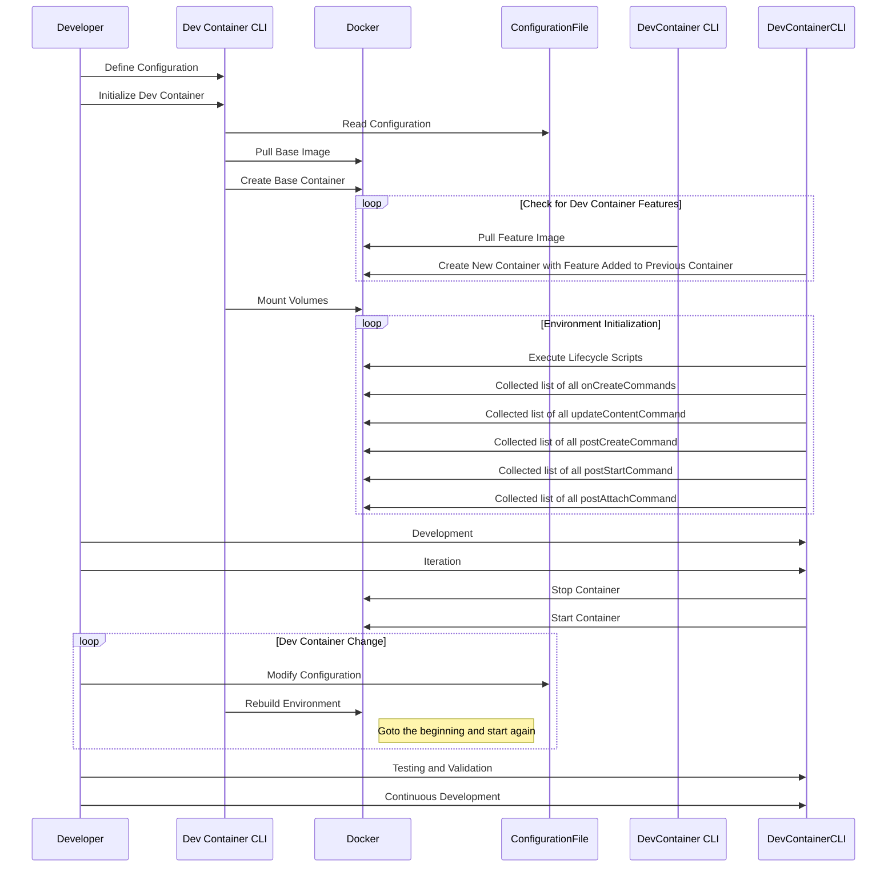

# Title: "Demystifying the Dev Container Lifecycle: A Walkthrough"

## Introduction

In the world of modern software development, having consistent and reproducible development environments is essential. Dev containers are fast becoming a standard in how developers build and consume standardized development environments. In this post, we'll dive into the lifecycle of a dev container. We'll explore the lifecycle of a dev container hopefully shedding light on how they work and how you can utilize them effectively. For this example, we're going to assume that we're using the [Dev Container CLI](https://github.com/devcontainers/cli).

## The Dev Container Lifecycle in Sequence Diagrams

A picture is worth a thousand words, and in this case, a sequence diagram can help us visualize the steps involved in the lifecycle of a dev container. Let's break it down:

This sequence diagram outlines the entire Dev Container lifecycle. Now, let's delve into the details.

## Step by Step: Understanding the Dev Container Lifecycle

### 1. Configuration Definition

At the heart of the dev container lifecycle is the configuration. Developers define their development environment in the `.devcontainer/devcontainer.json` file within their project.

### 2. Initialization

After configuration definition, the developer initializes the dev container using the Dev Container CLI. This process involves reading the configuration file and instructing Docker to pull the specified container image or build the Dockerfile.

### 3. Container Creation

Once the image is pulled, Docker creates a container based on the image and the configuration. This container encapsulates your development environment. Additionally, the Dev Container Spec supports Features which are a mechanism to add functionality on top of the specified base container. Features can depend on other Features and even define an installation order. There is a lot to talk about, expect an entire post just on Features.

### 4. Volume Mounting

Your local project files and source code are mounted into the container. This enables seamless interaction with your codebase, local files, etc.

### 5. Environment Initialization

If the configuration (`devcontainer.json` plus any specified Features) defined lifecycle scripts or commands are defined in the configuration, they are executed at this stage. This ensures allows you to specify not only the contents of the environment but the developer's workflow. You can fetch dependencies, compile, and even start the the application. All defined neatly in the `devcontainer.json`. 

### 6. Development and Iteration

Now you're in the heart of your development process. You can work within the dev container, and if needed, stop and start it again for debugging, testing, or iterative development.

### 7. Configuration Changes

At any point you or your team might decide to alter the configuration. The base image may have received updates, or you want to add a new tool via a Feature, etc. You might be worried that you'll need to stop what you're doing and launch a new workspace. Luckily, you can rebuild dev containers in place. All your changes will remain and the complete environment from the base container, the Features, to the lifecycle scripts will be rebuilt using the new configuration.

Dev containers make it easy for you and your team to keep up with environmental changes.

### 8. Testing and Validation

Before fully utilizing your enhanced dev container, it's crucial to test and validate the added Features to ensure they work seamlessly within your team's development workflow.

### 9. Continuous Development

With your dev container enriched and validated, you can continue your development work, taking full advantage of the added Features. There is lots more to talk about when it comes to dev containers. Stay tuned to learn more about using and writing your own Features, prebuilds, and more.

## Conclusion

Understanding the lifecycle of a dev container is key to harnessing its potential. Dev containers, along with the Dev Container CLI, offer a streamlined and reproducible way to manage your development environment. By following these steps, you can ensure that your workspace remains consistent and adaptable, making your software development journey a smoother and more productive one.
